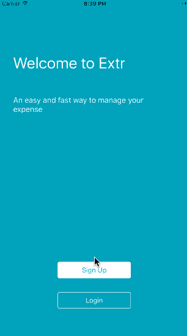

# Extr

An easy way to manage and categorize your personal and business expenses.

Extr is an group based expense tracking and analysis android app that helps a person, a family, a team and a company to manage their expenses better with contribution from all member users within the group. Extr is a fast and easy way to manage your daily expense. All you need to do is just snap a photo of your paper or electronic receipts, bills or other expenses and confirm the details, Extr will do the rest for you. For example, it will allow you to check out your weekly and monthly expense report for personal or your business, check out expense in your personalized category such as grocery and transportation. Extr can also simplify your business accounting by providing you with business audit-proof and help to manage your budget wisely by providing you with detailed expense analysis report.

## Core User Stories

- user can create a expense
- user can check out a expense detail
- user can update or delete a expense
- user can create a category
- user can check out a category detail
- user can update or delete a category
- user can check out expense summary
- user can check out weekly, monthly and yearly expense report
- user can search expense by date range
- user can search expense by category
- user can receive a weekly and monthly report notification
- user can create a group
- user can invite people to a group
- user can switch group to check out expenses in different group
- members can create and update expense in the group
- admin or members can have difference permission to handle expense items or check out different expense report based on the role.

## Libraries and tools used
- [AFNetworking](https://github.com/AFNetworking/AFNetworking) - Alamofire is an HTTP networking library written in Swift.
- [Kingfisher](https://github.com/onevcat/Kingfisher) - A lightweight, pure-Swift library for downloading and caching images from the web.
- [Realm](http://realm.io) - Realm is a mobile database: a replacement for SQLite & ORMs.

## Video Walkthrough 

Here's a walkthrough of implemented user stories:

## License

    Copyright 2016 Zekun Wang, Zhaolong Zhong

    Licensed under the Apache License, Version 2.0 (the "License");
    you may not use this file except in compliance with the License.
    You may obtain a copy of the License at

        http://www.apache.org/licenses/LICENSE-2.0

    Unless required by applicable law or agreed to in writing, software
    distributed under the License is distributed on an "AS IS" BASIS,
    WITHOUT WARRANTIES OR CONDITIONS OF ANY KIND, either express or implied.
    See the License for the specific language governing permissions and
    limitations under the License.
